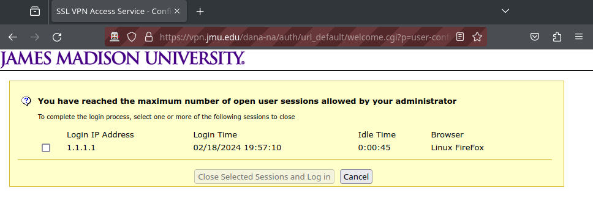

# JMU OpenConnect

This is a wrapper script around openconnect to help with authentication for the JMU VPN on Linux. Openconnect used to work fine until Ivanti purchased Pulse Secure, and then that broke something. This script opens up a web browser to allow the user to authenticate with Duo, and then grabs the DSID cookie to use for openconnect authentication.

## Installation
This script can easily be installed with pip or [pipx](https://pipx.pypa.io/stable/) with the following commands:

```console
$ pip3 install jmu-openconnect
$ # OR
$ pipx install jmu-openconnect
```

This script can also be used as a standalone script by downloading the `main.py` file and ensuring that selenium is installed with `pip3 install selenium`, or by cloning the repository and running `poetry install`.

## Usage
Once the script is installed, you can run the following command in your terminal:

```console
$ jmu-openconnect
```

You can also specify a username and password to be automatically typed in, however you will still have to do 2FA manually. You can specify one or the other or both, and if both are specified, the "Log in" button will automatically be clicked.

```console
$ jmu-openconnect -u <EID> -p <PASSWORD>
```

You can alternatively specify the `--prompt-password` option instead of using `-p`, which will prompt the user for a password without echoing, much like sudo. This is more secure as your password won't be saved in your command line history.

JMU OpenConnect defaults to using firefox, but you can easily change which browser you're using by specifying `--browser`, which accepts `firefox`, `chrome`, or `edge`.

```console
jmu-openconnect --browser chrome
```

To see all of the available options, run `jmu-openconnect --help`.

## Dependencies
This script just requires openconnect, [selenium](https://pypi.org/project/selenium/), and a webdriver. On my machine, it seems that the webdrivers are automatically installed if you have Firefox or Chromium installed, so you probably don't need to worry about this. If you are having problems, check the [Selenium Python Documentation](https://selenium-python.readthedocs.io/installation.html#drivers0).

## DSID Cookie was not found
If you get the error that the DSID cookie was not found, then you may be logged on in multiple places at once. Navigate to https://vpn.jmu.edu and after signing in, you should see a screen like this:



If this is the case, just select the box to remove that sign in and retry the script after verifying that you are signed out of all browser sessions. If this is not the problem, try running the script with `jmu-openconnect --debug-auth-error` to see the error for a longer period of time.